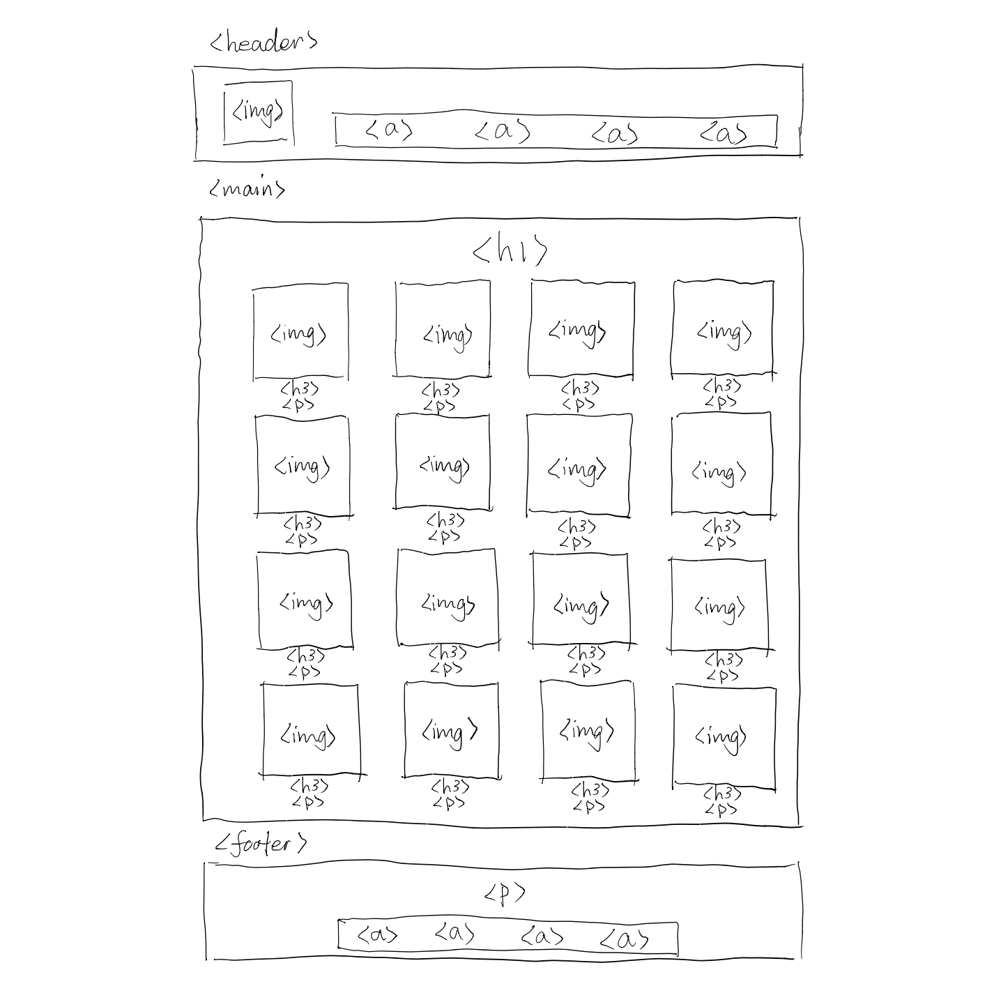
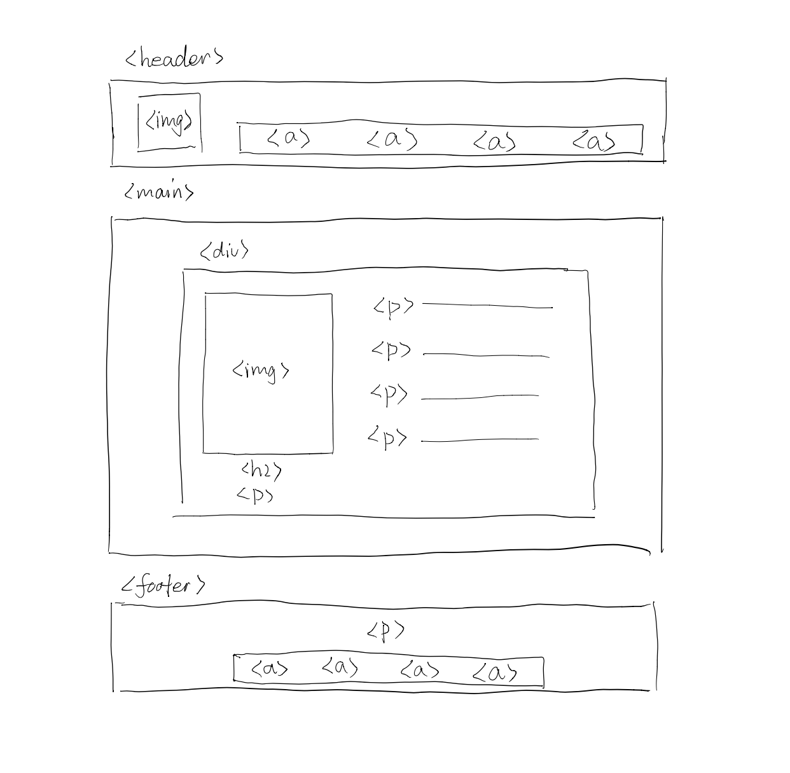
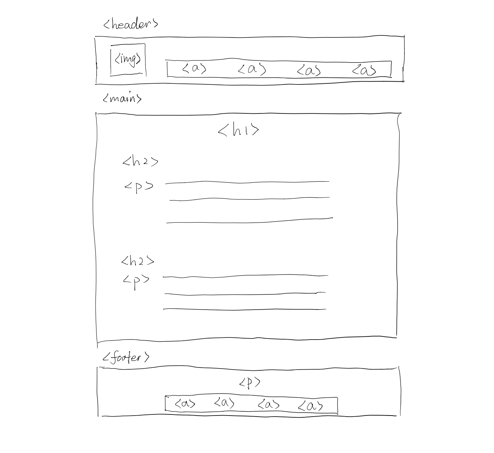
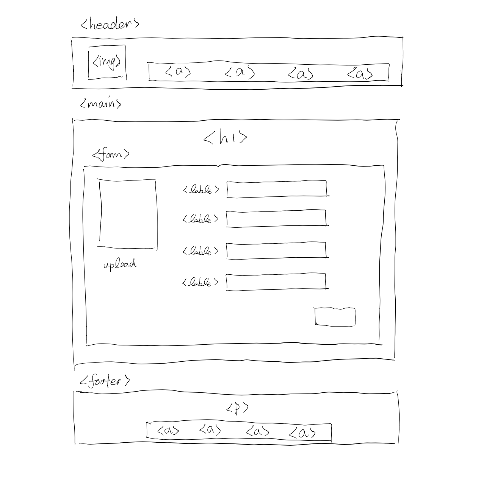
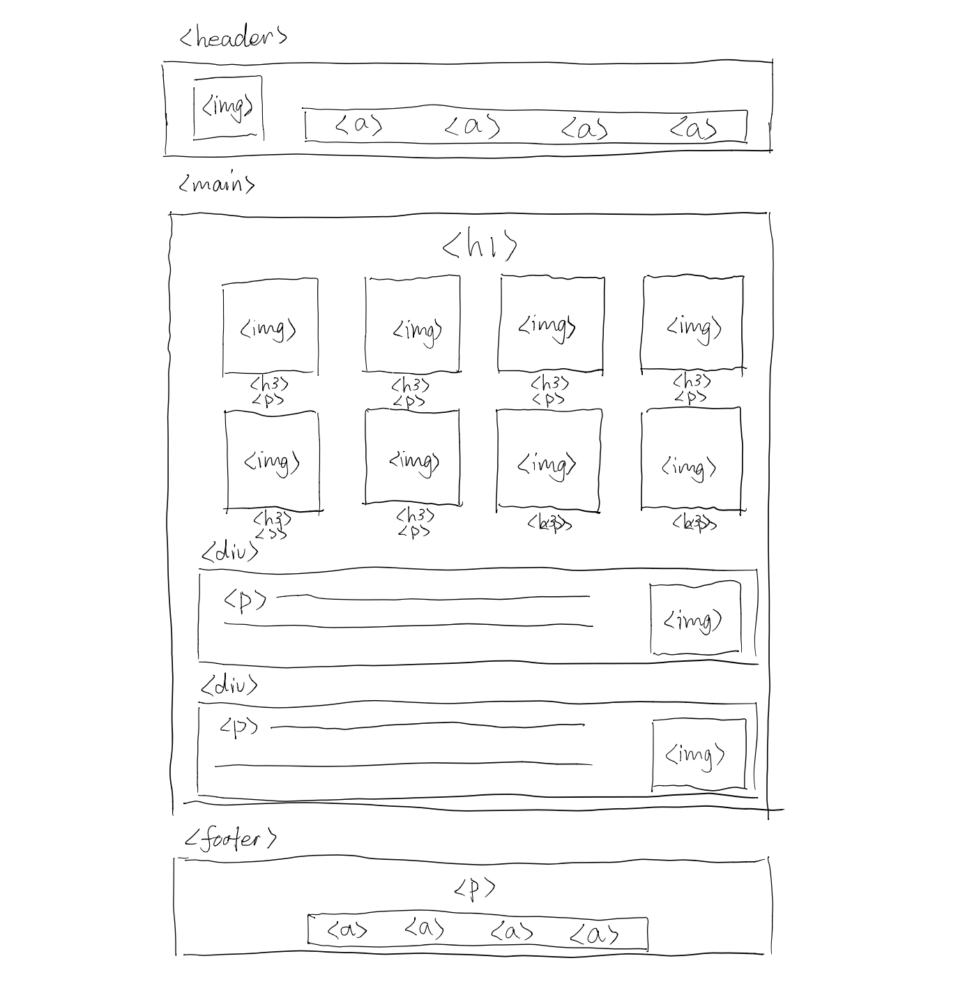
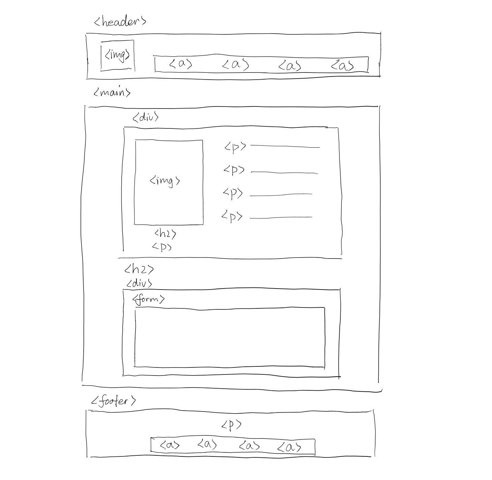
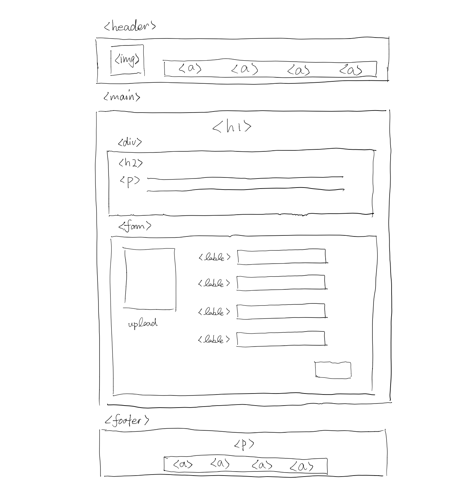
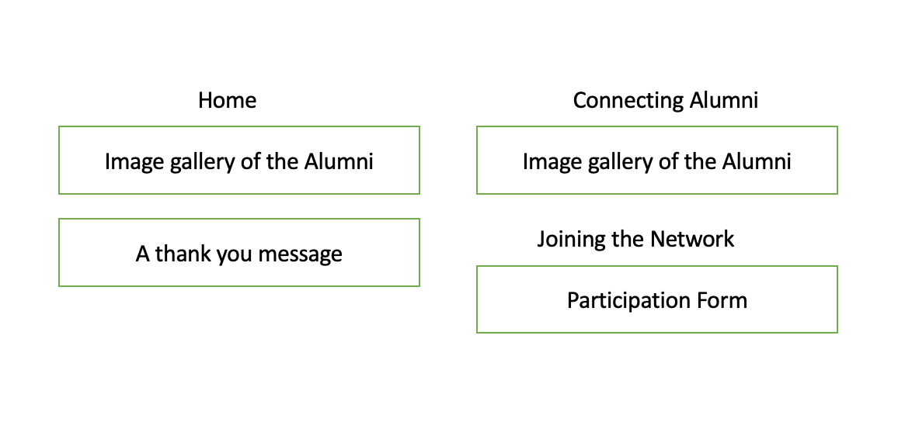
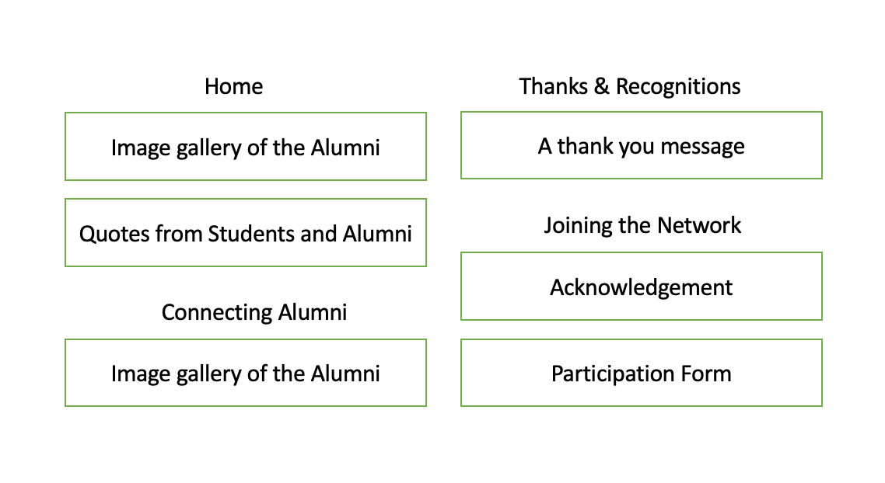

# Project 3: Design Journey

Be clear and concise in your writing. Bullets points are encouraged.

**Everything, including images, must be visible in Markdown Preview.** If it's not visible in Markdown Preview, then we won't grade it. We won't give you partial credit either. This is your warning.


## Design Plan

### Project 1 or 2
> Do you plan to reuse your Project 1 or 2 site?
> Which project?

No.

> If yes, please include sketches of the site's current design (you may copy the "final" sections from those assignments.)

TODO


### Describe your Media Catalog (Milestone 1)
> What will your collection be about?
> What type of media will your site display? (images, videos, audio)

It will be an alumni connection website for my high school (Shenzhen Senior High School). Alumni who are willing to connect may hare their information and contact on the website for students to reach out. It will display images (picture of the alumni).


### Audiences (Milestone 1)
> Briefly explain your site's audiences. Be specific and justify why each audience is appropriate for your site.
> You are required to have **two** audiences: "information consumers" and "site administrators"

Information Consumer: Students (including graduates) from Shenzhen Senior High School
* The students will browse the website and look for alumni they are interested in talking to

Site Administrator: Alumni from Shenzhen Senior High School
* The alumni can upload their picture, information, and contact on the website for the students to connect


### Personas (Milestone 1)
> Your personas must have a name and a "depiction". This can be a photo of a face or a drawing, etc.
> There is no required format for the persona.
> You may type out the persona below with bullet points or include an image of the persona. Just make sure it's easy to read the persona when previewing markdown.
> Your personas should focus on the goals, obstacles, and factors that influence behavior of each audience.

> Persona for your "consumer" audience:

<!-- Source: Shenzhen Senior High School Wechat Official Account https://mp.weixin.qq.com/s/EJC9AUDuh0ivOeLSeHb0_A -->

* Name: Yu
* Yu is a junior at Shenzhen Senior High School
* Goals:
  * She is looking for advices from alumni on college application
  * She wants to learn more about what it's like to attend each colleges
* Obstacles:
  * She has a hard time connecting alumni who graduated a long time ago
  * She found it hard to find an alumni with similar major interests

> Persona for your "administrator" audience:

<!-- Source: Shenzhen Senior High School Wechat Official Account https://mp.weixin.qq.com/s/NMyUnqjpVNfsuOuV692Dvw -->

* Name: Edward
* Edward is an alumnus of Shenzhen Senior High School
* Goal:
  * Edward wants to help students from his high school and share his experiences
* Obstacles:
  * He is concerned with cyber safety and is reluctant to respond to messages from the strangers
  * He had a hard time verifying whether the networking messages actually come from students from his high school


### Site Design (Milestone 1)
> Document your _entire_ design process. **We want to see iteration!**
> Show us the evolution of your design from your first idea (sketch) to the final design you plan to implement (sketch).
> Show us the process you used to organize content and plan the navigation, if applicable (card sorting).
> Plan your URLs for the site.
> Provide a brief explanation _underneath_ each design artifact. Explain what the artifact is, how it meets the goals of your personas (**refer to your personas by name**).
> Clearly label the final design.


The initial home page displays the pictures of all the alumni. However, this seems too crowded for a home page. The students visiting the home page might be overwhelmed.


This page shows what happens when the student clicks on the picture of the alumni. The detailed information and contacts can be accessed.


The Thanks and Recognitions page displays messages to thank the alumni for joining the network and for willing to help the students


On the join networks page, the alumni can fill out a form to upload their picture and information to the platform.

**Final: Home Page**

In the alternative design, I left fewer rows of alumni pictures on the homepage and added space for quotes from students or alumni so that new visitors get an idea of how the platform is going to help them.

**Final: Connecting Alumni Page**

I moved the previous homepage to a new page called Connecting Alumni. On this page the students will be shown all the pictures of the alumni and could access alumni from different years by selecting from a drop-down menu.

**Final: Details Page**

On the new details page, the students can directly send a email message from the contact form. This made it more convenient for the students to reach out.

**Final: Joining the Network Page**

On the new join networks page for the alumni, an acknowledgement will be displayed before the forms to inform those joining the platform that some of their information will become public.


Initially, the homepage displays a few rows of alumni pictures and thanks the alumni for joining the network. This allows Yu to get an idea of what to expect from the Platform. The Connecting Alumni page allows Yu to browse all the alumni. The Joining the Network page allows Edward to login and upload his information to introduce himself. However, the current design does not address Edward's concern in online privacy.

**Final Card Soring**

On the new card sorting, quotes and stories of the alumni are added to the homepage to introduce the platform more directly and vividly.
Since the the thanks and recognition message is not fitting the quotes so much, it is moved to a separate page. An acknowledgement explaining to what extent information on the platform is publicized is provided to Edward to address his concern.

**URLs design**
Home: `/`, `/home`

Connecting Alumni: `/connecting-alumni`

Thanks & Recognitions: `/thanks-and-recognitions`

Joining the Network: `/joining-the-network`

### Design Patterns (Milestone 1)
> Write a one paragraph reflection explaining how you used the design patterns in your site's design.

I have placed the filters on the places that filters would normally appear. This makes it easier for the users to figure out how to use the functions. The color theme is consistent on each page, so that it doesn't confuses the users while they browse the pages.


## Implementation Plan

### Requests (Milestone 1. Revise in Milestone 2)
> Identify and plan each request you will support in your design.
> List each request that you will need (e.g. view image details, view gallery, edit book, tag product, etc.)
> For each request, specify the request type (GET or POST), how you will initiate the request: (form or query string URL), and the HTTP parameters necessary for the request.

- Request: search for alumni
  - Type: GET
  - URL: /connecting-alumni?q=
  - Params: informations.first_name _or_ informations.last_name

- Request: filter the alumni according to graduation year
  - Type: GET
  - URL: /connecting-alumni?2019=1
  - Params: informations.graduation_year

- Request: filter the alumni according to country
  - Type: GET
  - URL: /connecting-alumni?us=1
  - Params: informations.country

- Request: sort the gallery according to order of graduation year
  - Type: GET
  - URL: /connecting-alumni?sort=earliest
  - Params: informations.graduation_year

- Request: edit the information of alumni
  - Type: GET
  - URL: /connecting-alumni/person?edit=user_id
  - Params: informations.user_id

- Request: upload information and join the platform
  - Type: POST
  - URL: /joining-the-network
  - Params: first_name, last_name, graduation_year, university, major, contact

- Request: save new information of an alumnus
  - Type: POST
  - URL: /connecting-alumni/person?id=user_id
  - Params: informations.user_id

- Request: update new first name
  - Type: POST
  - URL: /connecting-alumni/person?id=user_id
  - Params: informations.first_name

- Request: update new last name
  - Type: POST
  - URL: /connecting-alumni/person?id=user_id
  - Params: informations.last_name

- Request: update new graduation year
  - Type: POST
  - URL: /connecting-alumni/person?id=user_id
  - Params: informations.graduation_year

- Request: update new university
  - Type: POST
  - URL: /connecting-alumni/person?id=user_id
  - Params: informations.university

- Request: update new major
  - Type: POST
  - URL: /connecting-alumni/person?id=user_id
  - Params: informations.major

- Request: update new contact
  - Type: POST
  - URL: /connecting-alumni/person?id=user_id
  - Params: informations.contact

- Request: login
  - Type: POST
  - URL: /connecting-alumni _or_ /joining-the-network
  - Params: users.username and users.password

- Request: logout
  - Type: POST
  - URL: /connecting-alumni?logout= _or_ /joining-the-network?logout=

### Database Schema (Milestone 1. Revise in Milestone 2)
> Describe the structure of your database. You may use words or a picture. A bulleted list is probably the simplest way to do this. Make sure you include constraints for each field.

> Hint: You probably need a table for "entries", `tags`, `"entry"_tags` (stores relationship between entries and tags), and a `users` tables.

> Hint: For foreign keys, use the singular name of the table + _id. For example: `image_id` and `tag_id` for the `image_tags` (tags for each image) table.

Table: users
- id INTEGER NOT NULL PRIMARY KEY AUTOINCREMENT UNIQUE,
-	name TEXT NOT NULL,
-	username TEXT NOT NULL UNIQUE,
-	password TEXT NOT NULL

Table: sessions
-	id INTEGER NOT NULL PRIMARY KEY AUTOINCREMENT UNIQUE,
-	user_id INTEGER NOT NULL,
-	session TEXT NOT NULL UNIQUE,
- last_login   TEXT NOT NULL,
- FOREIGN KEY(user_id) REFERENCES users(id)

Table: groups
-	id INTEGER NOT NULL PRIMARY KEY AUTOINCREMENT UNIQUE,
-	name TEXT NOT NULL UNIQUE

Table: memberships
-	id INTEGER NOT NULL PRIMARY KEY AUTOINCREMENT UNIQUE,
- group_id INTEGER NOT NULL,
- user_id INTEGER NOT NULL,
- FOREIGN KEY(group_id) REFERENCES groups(id),
- FOREIGN KEY(user_id) REFERENCES users(id)

Table: informations
-	id	            INTEGER NOT NULL PRIMARY KEY AUTOINCREMENT UNIQUE,
- user_id         INTEGER NOT NULL,
-	first_name     	TEXT NOT NULL,
- last_name     	TEXT NOT NULL,
- graduation_year INTEGER NOT NULL,
- university      TEXT NOT NULL,
- major           TEXT NOT NULL,
- country         TEXT NOT NULL,
- contact         TEXT NOT NULL,
- FOREIGN KEY(user_id) REFERENCES users(id)

### Database Query Plan (Milestone 1. Revise in Milestone 2)
> Plan your database queries. You may use natural language, pseudocode, or SQL.

```
SELECT * FROM informations;
```

```
SELECT * FROM informations WHERE (first_name LIKE '%' || :search || '%') OR (last_name LIKE '%' || :search || '%');
```

```
SELECT * FROM informations ORDER BY graduation_year DESC;
```

```
SELECT * FROM informations ORDER BY graduation_year ASC;
```

```
SELECT * FROM informations WHERE id = :id;
```


### Code Planning (Milestone 1. Revise in Milestone 2)
> Plan any PHP code you'll need here using pseudocode.
> Use this space to plan out your form validation and assembling the SQL queries, etc.
> Tip: Break this up by pages. It makes it easier to plan.

```
if a has logged in:

  show the home page gallery as links:

if the person has not logged in:

  show the home page gallery as image only:
```

```
if a person request to visit the alumni connection page:

  if the person has logged in:
    show the page
    allow the user to use the search function
    allow the user to use the filter function
    allow the user to use the sort function

    if the person clicks on his or her picture:
      show the edit link

      if the owner wants to edit:
        show the update form:

          if click on save and nothing is empty:
            save the changes

  if the person has not logged in:
    ask the person to login
```

```
if search for alumnus:
  get alumnus whose first name or last name matches the search input

  if the search is empty:
    display nothing

  make
```

```
if a person request to visit the join the network page:

  if the person has logged in:

    if the person is an alumnus:
      show the form

    otherwise:
      show the error message

  if the person has not logged in:

    ask the person to login
```

```
if a new person joins:

  if first name is empty:
    make the form invalid
    show feedback

  if last name is empty:
    make the form invalid
    show feedback

  if graduation year is not one of the years between 2015-2021:
    make the form invalid
    show feedback
    make current input sticky

  if university name is empty:
    make the form invalid
    show feedback

  if major is empty:
    make the form invalid
    show feedback

  if contact is empty:
    make the form invalid
    show feedback

  if everything is correct
    add the person into the database using sql query

    if successfully inserted:
        show the successful message

  if the form is invalid:
    make the current inputs sticky
```

```
if a new person is successfully added:
    show the success message with the first name and last name
if insert failed:
    show the failure message with the first name and last name
```


## Submission

### Audience (Final Submission)
> Tell us how your final site meets the needs of the audiences. Be specific here. Tell us how you tailored your design, content, etc. to make your website usable for your personas. Refer to the personas by name.

TODO


### Additional Design Justifications (Final Submission)
> If you feel like you haven’t fully explained your design choices in the final submission, or you want to explain some functions in your site (e.g., if you feel like you make a special design choice which might not meet the final requirement), you can use the additional design justifications to justify your design choices. Remember, this is place for you to justify your design choices which you haven’t covered in the design journey. You don’t need to fill out this section if you think all design choices have been well explained in the design journey.

TODO


### Self-Reflection (Final Submission)
> Reflect on what you learned during this assignment. How have you improved from Project 1? What things did you have trouble with?

TODO


### Grading: Mobile or Desktop (Final Submission)
> When we grade your final site, should we grade this with a mobile screen size or a desktop screen size?

TODO


### Grading: Step-by-Step Instructions (Final Submission)
> Write step-by-step instructions for the graders.
> The project if very hard to grade if we don't understand how your site works.
> For example, you must login before you can delete.
> For each set of instructions, assume the grader is starting from /

Viewing all entries:
1. TODO
2.

View all entries for a tag:
1. TODO
2.

View a single entry and all the tags for that entry:
1. TODO
2.

How to insert and upload a new entry:
1. TODO
2.

How to delete an entry:
1. TODO
2.

How to view all tags at once:
1. TODO
2.

How to add a tag to an existing entry:
1. TODO
2.

How to remove a tag from an existing entry:
1. TODO
2.
