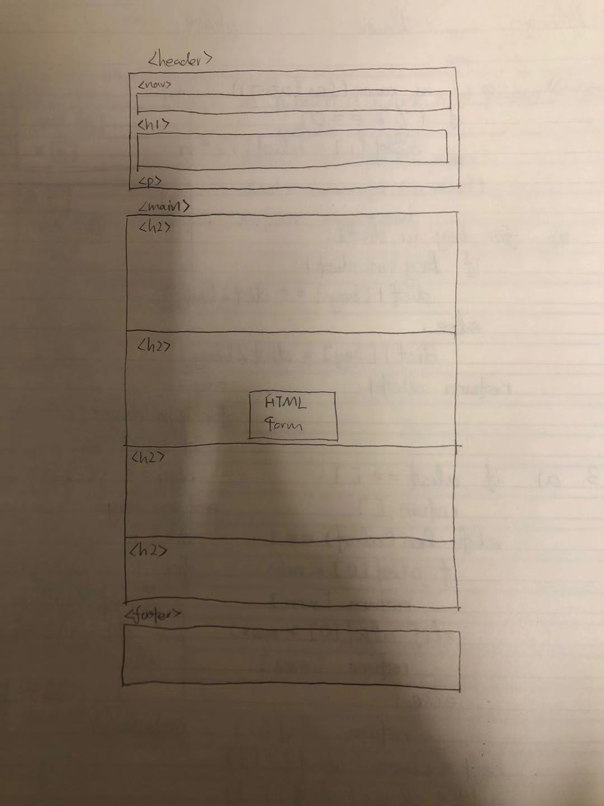
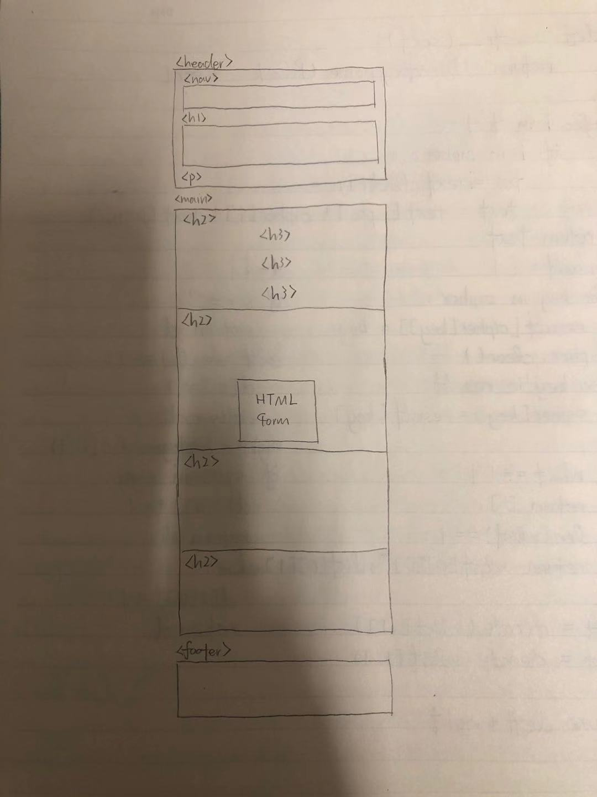
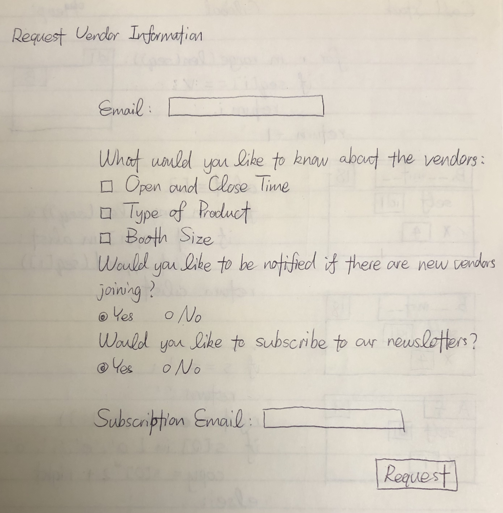
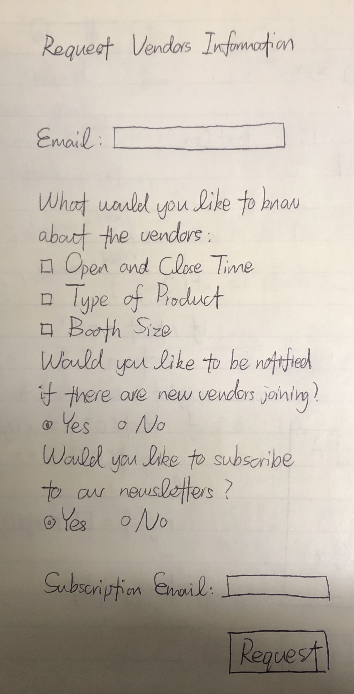
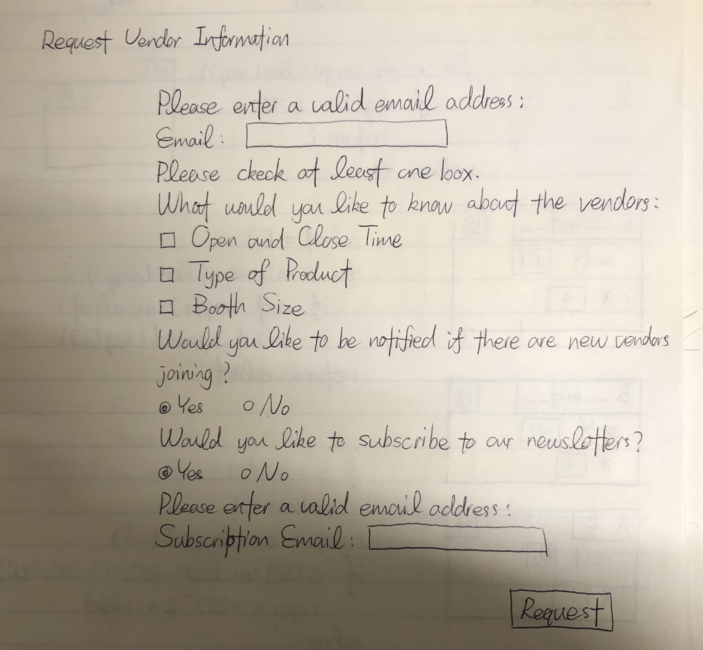
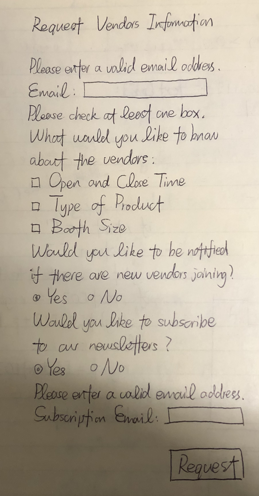

# Project 3: Design Journey

**For milestones, complete only the sections that are labeled with that milestone.**

Be clear and concise in your writing. Bullets points are encouraged.

**Everything, including images, must be visible in Markdown Preview.** If it's not visible in Markdown Preview, then we won't grade it. We won't give you partial credit either.

**Make the case for your decisions using concepts from class, as well as other design principles, theories, examples, and cases from outside of class.**

You can use bullet points and lists, or full paragraphs, or a combination, whichever is appropriate. The writing should be solid draft quality but doesn't have to be fancy.

## Project 1 or Project 2
> Which project will you add a form to?

Project 1 or 2 (2)


## Audience (Milestone 1)
> Who is your site's target audience? This should be the original audience from Project 1 or Project 2. You may adjust the audience if necessary. Just make sure you explain your rationale for doing so here.

The intended audience is international students at Cornell. This website helps them to get more familiar with the local culture and provides them with detailed informations about the festival.


## Audience's Needs (Milestone 1)
> List the audience's needs that you identified in Project 1 or 2. Just list each need. No need to include the "Design Ideas and Choices", etc. You may adjust the needs if necessary. However, any changes you make to the needs for this project should be clearly identified and justified.

- Need 1: Clearer parking information.
- Need 2: An event timeline.
- Need 3: Information about the scale of the event.


## HTML Form + User Needs Brainstorming (Milestone 1)
> Using the audience needs you identified, brainstorm possible options for an HTML form for the site. List each idea and provide a brief rationale for how the HTML form addresses that need.

- A transportation information request form
    - The HTML form will request email address from the user and also asks the user to check all types of transportation that the user needs information in. By submitting the form, the transportation information will be sent to the user's email address.
- A website feedback form
    - The HTML form will ask the user to rate the overall experience using the website by clicking on buttons. It will also provide a text area where the user may choose to provide additional feedback. The email and phone number are optional for the user to leave. By submitting the form, the feedback will be sent to the web developer.
- A vendors information request form
    - The HTML form will request email address from the user and request the user to check the items of information that they want to learn about. By submitting the form, the vendors' information will be sent to the user's email address.


## HTML Form Proposal & Rationale (Milestone 1)
> Make a decision about your site's form. Describe the purpose of your proposed form for your Project 1 or 2 site. Provide a brief rationale explaining how your proposed form meets the needs of your site's audience.
> Note: If your form is a contact form, we expect to see a thorough justification explaining how a contact form addresses the user's _actual_ needs. In your justification explain how a contact form better suits the needs of your user compared to the alternatives (e.g. sending you an email using your email address).

Form Proposal: A transportation information request form

User Needs Rational: A transportation information request form allows the user to request and access highly detailed parking or other transportation information that the website cannot display all at once.

Form Proposal: A website feedback form

User Needs Rational: A website feedback form is open to whatever requests or issues that the users bring up. This helps the website to instantly implement itself and to provide the user with whatever information they need the most.

Form Proposal: A vendors information request form

User Needs Rational: A vendors information request form allows the user to request and access details of the vendors including their open and close time, their booth size and their location. This allow the users to make a more detailed timeline and have a better idea of the scale of the Apple Fest.


## Form User Data (Milestone 1)
> Think through and plan the data you need to collect from the users. Do you need their name? Email address? etc.

- Email: required.
    - The email address is required because there has to be a place to send the requested information.

- Type of vendor information: optional but at least one should be requested.
    - The user does not have to be interested in every aspects of the vendor, it is more efficient to only provide them with the information they need. But they will have to choose one of the options or there is no point for them to request for information.

- New vendor notification choice: required.
    - the user doesn't have to be interested in other vendors, but they have to indicate whether they need the information.

- Newsletter subscription choice : required.
    - the user doesn't have to bey interested in the Apple Fest's newsletters, but they have to indicate whether they want to subscribe.

- Subscription email: required if the user wants to subscribe the wewsletter.
    - if the user wants to subscribe the newsletters they have to leave their email adress or there will be nowhere to send the newsletters.


## Form Components & Validation Criteria (Milestone 1)
> For each piece of data you plan to collect from the users, identify an appropriate HTML component to collect that data and decide the validation criteria (e.g. whether this data is _required_). Briefly explain your reasoning for the component choice and the validation criteria.

* Text-Input Control
    * Email (required): text field; `<input type="email">`

- Vendor Information (optional but at least one shoudl be checked): checkbox; `<input type="checkbox">`
    - Reasoning for the component choice: checkboxes list options for the users to select what information they need
    - Validation criteria: At least one checkbox should be checked to submit the form

- New Vender Notification (required): radio button; `<input type="radio">`
    - Reasoning for the component choice: there is only two choices "yes" and "no", and an answer is required from the user. A radio buttons present the choice clearly and has a default value so the users are made to choose
    - Validation criteria: Automatically filled in

- Newsletter Subscription (required): radio button; `<input type="radio">`
    - Reasoning for the component choice: there is only two choices "yes" and "no", and an answer is required from the user. A radio buttons present the choice clearly and has a default value so the users are made to choose
    - Validation criteria: Automatically filled in

- Subscription Email (required if indicated "yes" in subscription): text field; `<input type="email">`
    - Reasoning for the component choice: an email address is should be an email input
    - Validation criteria: A valid email must be filled in to send the newsletters to the subscriber


## Form Location (Milestone 1)
> Which HTML file will you place your form?

events.html

> Sketch the location of the form in that page. This sketch need not be fancy. You don't need to provide many details of the page or form. Just plan the location of the form on the page and communicate that to us. You can literally have a box that says "FORM HERE."

**Desktop Location**




**Mobile Location**




## Form Design (Milestone 1)
> Include sketches on your form below. Include sketches of your **mobile and desktop** versions without corrective feedback. Show us the evolution of your design and the alternatives you considered.

**Desktop Sketches**



**Mobile Sketches**




## Form Feedback Design (Milestone 1)
> Include sketches of your **mobile and desktop** with _corrective feedback_. Show us the evolution of your design and the alternatives you considered.

**Desktop Feedback**




**Mobile Feedback**




## Form Implementation Planning (Milestone 1)
> What submission method will your form use? GET or POST. Explain your reasoning.

I will use POST because the user's email address should be a private data and should be hidden from the url. Otherwise, whoever get that url may repeat requiring information for the user, causing a lot of trouble.

> For your site's `<form>` element, plan all HTML attributes that you will need and their values. Hint: action=, method=, novalidate

- `action="https://www.cs.cornell.edu/courses/cs1300/2020fa/submit.php`
- `method="post"`
- `novalidate`


## Additional Information (Milestone 1)
> (optional) Include any additional information, justifications, or comments we should be aware of.

TODO


## Plan Validation Pseudocode (Final Submission)
> Write your form validation pseudocode here.

```
if "yes" is selected for news subscription:
    show the text area to enter the subscription email
if "no" is selected for news subscription:
    hide the text area to enter the subscription email

when submit the form:
    if there is a valid email address:
        hide the feedback message
    if there isn't a valid email address:
        show the feedback message
        stop the form from submitting

    if at least one box is checked:
        hide the feedback message
    if no box is checked:
        show the feedback message
        stop the form from submitting

    if a subscription email is needed and there is a valid email address:
        hide the feedback message
    if a subscription email is needed and there isn't a valid email address:
        show the feedback message
        stop the form from submitting

    submit the form
```


## Additional Design Justifications (Final Submission)
> If you feel like you haven’t fully explained your design choices in the final submission, or you want to explain some functions in your site (e.g., if you feel like you make a special design choice which might not meet the final requirement), you can use the additional design justifications to justify your design choices. Remember, this is place for you to justify your design choices which you haven’t covered in the design journey. Use it wisely. However, you don’t need to fill out this section if you think all design choices have been well explained in the final submission design journey.

TODO


## Self-Reflection (Final Submission)
> This was the first project in this class where you coded some JavaScript. What did you learn from this experience?

* To code good JavaScript, we can start by breaking down the big tasks into several small validation tasks
* A good to start off is writing pseudocode and then replace them line by line with real JavaScript codes
* To validate JavaScript code we need to log the code into the console


> Reflect on how HTML, CSS, and JavaScript together support client-side interactivity. If it's helpful, you can describe your mental model of client-side interactivity or explain how the general idea of showing and hiding content can be used to implement other forms of client-side interactivity beyond form validation and feedback.

Apart from form and validation feedbacl, the conbination of the three languages could also realize functions such as the expansion of comments on a website or the comment raking feature. It may also allow functions such as live poll, as HTML will structure the texts and graphs, CSS will style how the categories looks differently, and JavaScript will control the live changes of the contents while the audiences submit their responses.


> Take some time here to reflect on how much you've learned since you started this class. It's often easy to ignore our own progress. Take a moment and think about your accomplishments in this class. Hopefully you'll recognize that you've accomplished a lot and that you should be very proud of those accomplishments!

* I am able to design an interactive website based on the needs of the intended audiecnes
* I am able to design the interactivities based on user-need and the developer's need
* I have learnt the visual pricipal behind a form
* I am able to design forms that are visually user-friendly
* I have learnt how to break down a seemingly huge coding task by dividing it into small tasks and start off by pseudocode and then replace it by real code
